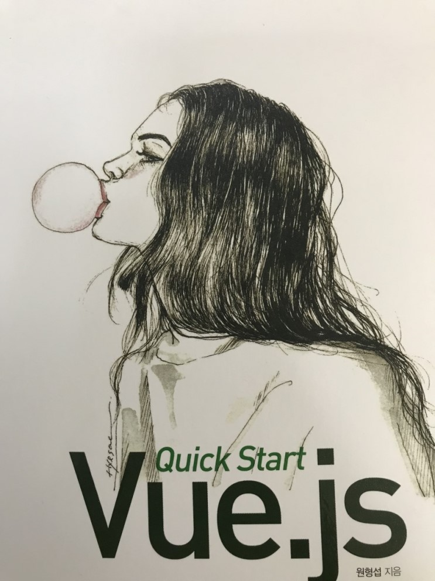

Vue.js Quick Start
================================

</img>

>Vue.js 퀵 스타트 책을 공부하며 내용, 생각을 정리한 글입니다.<br/>
>링크를 클릭하면 상세 정리 페이지로 이동합니다. <br/>
>각 페이지의 소스코드는 위에 디렉토리별로 나눠놨습니다. 

* 책 없이 보시면 의미가 없는 포스팅입니다.
* 좋은 책 써주신 저자를 위해서라도 꼭 구입하시고 봐주세요.

#### 1. [시작하기](http://1ilsang.blog.me/221139347379)
```javascript
Vue 소개, 장점, plugin, vue-cli
```

#### 2. [기초](http://1ilsang.blog.me/221249302573)
```javascript
v-text, v-html, v-bind, v-model, v-show, v-if, v-else, v-for, v-pre, computed, Search Filter
```

#### 3. [Vue 인스턴스](http://1ilsang.blog.me/221250523238)
```javascript 
data, el, computed vs methods, watch, fetch, _.debounce, v-cloak, Lifecycle
```

#### 4. [Event](http://1ilsang.blog.me/221254097398)
```javascript
v-on, prevent, BUBBLING_PHASE, stopPropagation, keyup, mouse event 
```

#### 5. [Style](http://1ilsang.blog.me/221254160523)
```javascript
mouseOver, class Style, computed Style, component Style, TodoList App
```

#### 6. 컴포넌트 기초
- 이후 내용은 비공개

- - -
#### [뒤로 가기](./../../../Study/)
